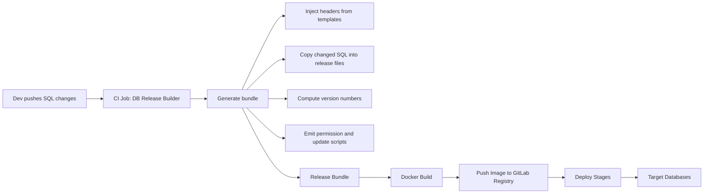

# **DB Release Builder 🗄️**

*Automating SQL release packaging, versioning, and containerized delivery in CI/CD pipelines*

## **Overview**

**DB Release Builder** is a Python-based automation tool that runs inside CI/CD pipelines to produce **structured, versioned database release bundles**.

Instead of relying on developers to manually prepare SQL files, the pipeline:

1. **Runs DB Release Builder** to collect changed SQL files, apply headers/templates, and bump versions.
2. **Builds a Docker image** containing the generated release package (via the included `Dockerfile`).
3. **Pushes the image** to your GitLab container registry (as defined in `.gitlab-ci.yml`).
4. Makes the image available for **downstream deployment stages**.

This ensures every release is **consistent, traceable, and deployment-ready**.

---

## **Key Benefits**

✅ **Standardized releases** — headers, permissions, and script ordering are applied automatically

✅ **Version tracking** — old/new database versions are parsed and recorded for AGT and AWB systems

✅ **Error reduction** — eliminates human mistakes in packaging scripts

✅ **Audit-friendly** — bundles follow the same structure every time, easy to review and sign off

✅ **CI/CD native** — designed to be invoked by pipelines and shipped as container images


---

## **How It Works**

### 1. Input

* Developers commit SQL changes into structured folders (`tables`, `views`, `stored_procedures`, etc.).
* Version info (old/new) is kept in version files or parsed from Git tags.

### 2. Release Packaging (inside CI job)

* **`bgt_release_handler.py`** orchestrates the entire process.
* **`files_manager.py`** applies replacements, injects headers, and copies SQL into release files.
* **`release_resource_manager.py`** generates empty release SQLs, permission scripts, and batch wrappers from templates.
* **`version_manager.py`** determines version upgrades for AGT and AWB databases.

### 3. Output

* A **release bundle** with:

  * SQL scripts ordered (`1_create.sql`, `2_alter.sql`, …, `9_version_update.sql`)
  * Headers applied (author, timestamp, version info)
  * Permissions and deployment guides generated from templates

### 4. Containerization & Delivery

* The included **`Dockerfile`** packages the release bundle into a container image.
* The **`.gitlab-ci.yml`** pipeline logs in to GitLab’s registry, builds the image, tags it, and pushes it.
* Downstream jobs pull the image and run the SQL release against target databases.

---

## **Templates**

The tool relies on `src/file_templates/` to enforce structure, including:

* `default_header.txt` / `defalt_header_with_create.txt` → standardized SQL headers
* `8_permission_datatrak_scripts.sql` → permissions script
* `9_new_datatrak_mis_version_update_scripts.sql` → version bump script
* `BGT MsSQL DBs Release Deployment Guide.docx` → auto-populated release guide

---

## **Pipeline Diagram**

### Mermaid (GitHub-rendered)



### ASCII fallback

```
[Dev pushes SQL] ---> [CI: DB Release Builder] ---> (Generate bundle)
                               |                       |-- headers from templates
                               |                       |-- copy changed SQL
                               |                       |-- old->new versions (AGT/AWB)
                               |                       |-- permissions & version scripts
                               v
                      [Structured Release Bundle]
                               |
                               v
                      [Docker Build -> Image]
                               |
                               v
                  [Push to GitLab Container Registry]
                               |
                               v
                   [Deploy Stages / Environments]
                               |
                               v
                          (Target Databases)
```

---

## **Why This Matters**

Manual database releases are risky and inconsistent. With **DB Release Builder**:

* Every release is **consistent and auditable**
* Release images can be reused across environments
* DevOps teams can focus on **deployment orchestration**, not manual packaging
* CI/CD pipelines become the **single source of truth** for database release flows

---

## **Maintainer**

👤 **Sandesh Nataraj**
📧 [sandeshb.nataraj@gmail.com](mailto:sandeshb.nataraj@gmail.com)